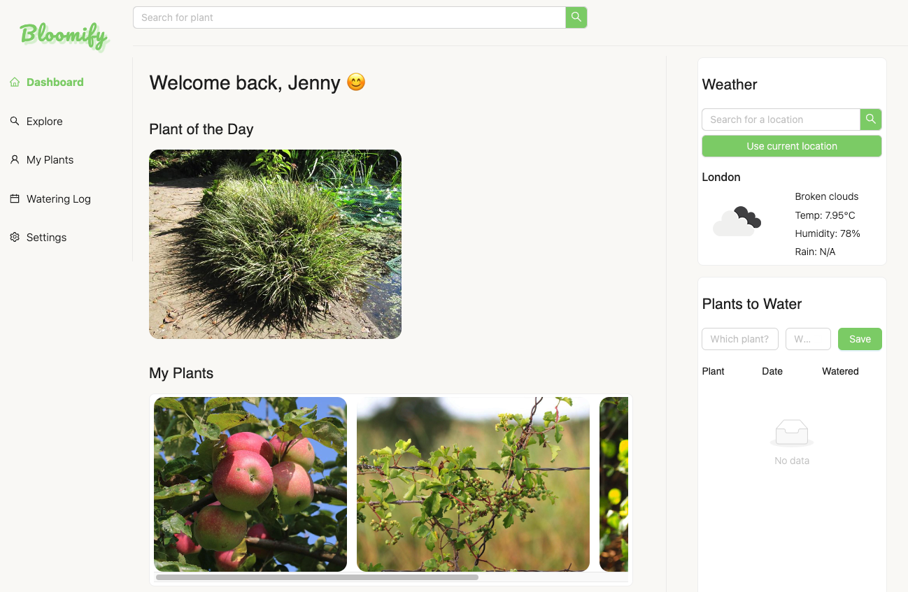

# Bloomify

## Table of Contents
- [Description](#description)
- [Features](#features)
- [Installation](#installation)
- [Usage](#usage)
- [Tests](#tests)
- [Technologies Used](#technologies-used)
- [License](#license)
- [Acknowledgments](#acknowledgments)
- [Contact](#contact)

## Description
Bloomify is a web application for both novice and expert plant parents alike. It allows users to explore new plants & flowers and save plants they own, or want to own, to their 'sanctuary'. The application also provides a way to keep track of plant watering schedules. 

This application was created over 2 weeks, using React. 

## Features
Bloomify offers a suite of features designed to enhance the gardening experience for plant enthusiasts of all levels. With a user-friendly interface and data powered by the Perenual API, Bloomify simplifies the process of discovering and managing your plants. Here's what you can do with Bloomify:

### Plant Search
- Keyword Search: Easily find plants and flowers using simple keywords. Perfect for when you're looking for a specific plant or just browsing for inspiration.
- Advanced Search: Utilize the advanced search feature to find plants that match specific care requirements, such as sunlight exposure, watering needs, and more. This tailored search ensures you find plants that thrive in your environment.

### Plant Descriptions
In-depth Information: For each plant returned by the search, access detailed descriptions and vital characteristics such as scientific name, preferred climate, watering and sunlight needs, and much more. This helps you understand exactly how to care for your plants.

### Plant Sanctuary
Log and Wishlist: Create your own 'Plant Sanctuary' where you can log plants you currently own or wish to acquire in the future. This personal plant collection helps you keep track of your gardening journey.

### Watering Log
- Watering Schedule: Keep track of watering schedules with the integrated log and calendar. When you add a plant and its watering date, the information automatically populates your calendar.
- Reminders: Receive pop-up reminders on the days your plants need watering, ensuring they always receive the care they need.

### Weather Widget
Real-Time Weather Updates: The weather widget displays current weather conditions, assisting you in making informed decisions about watering your outdoor plants. Whether it's a sunny day or a rainy afternoon, you'll know exactly what your garden needs.

### User Settings
Personalization: Set your username and location to personalize your Bloomify experience. Choose to use geolocation for automatic updates or enter your location manually. This customization ensures that weather updates and reminders are relevant to your specific locale.

### Dashboard
Quick Overview: The Dashboard unifies all of Bloomify's features in one convenient place. Check on your plants, view upcoming watering dates, and see the current weather, all at a glance. This central hub makes managing your garden easier than ever.

Bloomify is designed to be your go-to digital gardening companion, offering tools and information to help your plants flourish. Whether you're a seasoned gardener or just starting out, Bloomify simplifies the care process and makes gardening a joy.

## Installation
None - this is a web application that can be accessed via the browser.

## Usage
To view the webpage, no installation is required, you can simply access the live URL here: https://jennysiu.github.io/Bloomify/

Screenshot of deployed app:

## Tests
Tests can be found in the src/__test__ folder, and uses Vitest.

To run the test suite, ensure you have all project dependencies installed. If you haven't installed the dependencies yet, run:

1. (npm install)

After installing the dependencies, you can run the tests with the following command:

2. (npm run test)

## Technologies Used
- HTML5
- CSS3
- Ant Design
- React
- Netlify
- Perenual APIs
- OpenWeatherMap API
- Figma
- Node.js
- Dayjs
- NPM Packages: Axios, FontAwesome Icons, Vite, Vitest, React-Router-Dom

## License
Licensed under the MIT License.

## Acknowledgments
- Perenual APIs: https://perenual.com/ 
- OpenWeatherMap API: https://openweathermap.org/
- Ant Design: https://ant.design/ 
- shecodes.io
- freecodecamp.org
- geeksforgeeks.com
- stackoverflow.com

## Contact
Feel free to reach out to us if you have any questions or feedback.

Jenny Siu / [Email](jenny.siu79@gmail.com) / [LinkedIn](https://www.linkedin.com/in/jenny-siu-534576156/)

Laura Kane / [Email](laurakanesocials@gmail.com) 

Davou Jobbi 

Ahmed Ibrahim 

Adrianna Derkacz 
